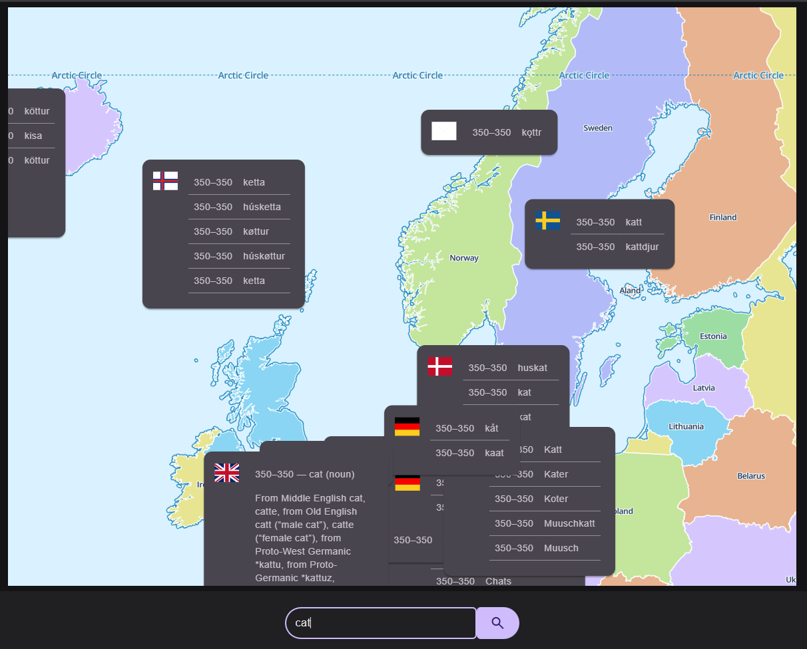
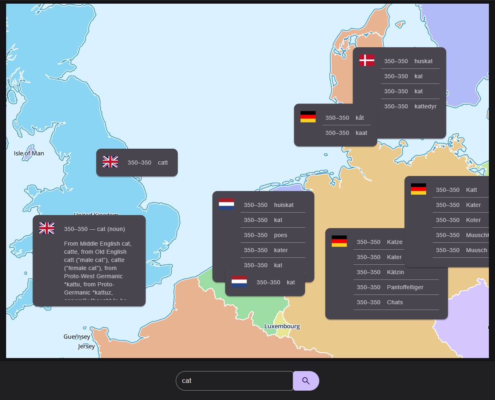

# Etymology Map

Currently maps Germanic roots of English words

wip

## Use

    mkdir data
    curl -L -o data/raw-wiktextract-data.jsonl \
        https://huggingface.co/datasets/aletrn/wiktionary/resolve/main/raw-wiktextract-data.jsonl

    bun db:build

    Total words inserted: 5300
    Total translations inserted: 31629
    Skipped empty translations: 772
    Skipped non-Germanic translations or words: 1656820

    bun db:see craft
    # Should output json for 'craft'

    bun dev

    bun build
    bun deploy

## To Do

* If no exact match is found, prefix search may return a list - allow the user to select from that
* Time slider
* Expand to Latinate and other words

## Sources

Words come from a [dump](https://huggingface.co/datasets/aletrn/wiktionary/blob/main/raw-wiktextract-data.jsonl)
of Wiktionary. Out of 1.41 million entries, only around 8,000 have translations.

The data is not great. Here's the entry for 'dog' via `tsx scripts/see.tsx dog`:

    Word: 
        {
            id: 81477,       
            word: 'DOG',     
            lang: 'en',      
            pos: 'noun',     
            etymology: null, 
            year_start: 1500,
            year_end: 9999   
        }
    Translations: []

## To Do

Maybe [this](http://etym.org/) is better?

Maybe `zoom` is better as `style={{ transform: `scale(${zoom()})`, transformOrigin: "top left" }}`?

## Credit

Static build indexes the [Google Top 10,000 Words](https://raw.githubusercontent.com/first20hours/google-10000-english/refs/heads/master/google-10000-english.txt) - minus brand names, which are sadly quite frequent.

## Test

`mouse`
`face`