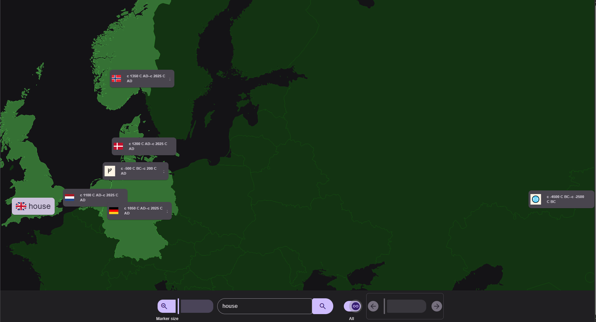

# Etymology Map

A local-first time-boxed geographical map of the etymology of 10,000 English words.

Uses `sql.js` to host a database of [Google Top 10,000 Words](https://raw.githubusercontent.com/first20hours/google-10000-english/refs/heads/master/google-10000-english.txt) as [extracted](https://kaikki.org/dictionary/rawdata.html) from [Wiktionary/](https://www.wiktionary.org/) by the [Wikiextract](https://aclanthology.org/2022.lrec-1.140/) folks.

## Use

    mkdir data
    curl -L -o data/raw-wiktextract-data.jsonl \
        https://huggingface.co/datasets/aletrn/wiktionary/resolve/main/raw-wiktextract-data.jsonl
    bun db:build

    bun dev

    bun build
    bun deploy

## Branches

The original branch uses the Solid-Start library, `better-sqlite3`, and is now named `with-server`.

## Stack

Solid/Solid-Start, Vite, Maplibre GL, Flag Icons, BeerCSS, sql.js/better-sqlite3.

## To Do

* If no exact match is found, prefix search may return a list - allow the user to select from that
* Maybe [this](http://etym.org/) is better?
* Maybe `zoom` is better as `style={{ transform: `scale(${zoom()})`, transformOrigin: "top left" }}`?

## Test Words

`mouse`
`face`